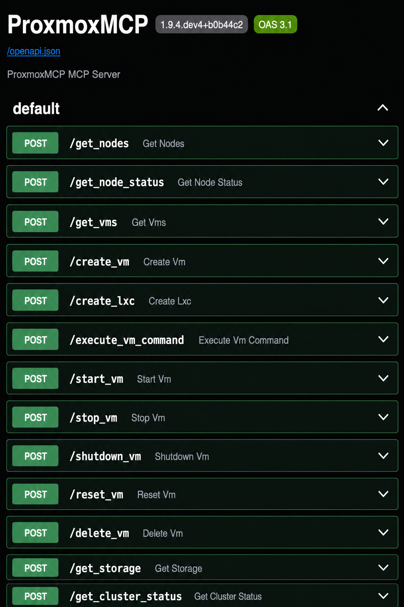

# cursor-proxmox-mcp - Proxmox MCP Server for Cursor with OpenAPI (optional)



Cursor focused Python-based Model Context Protocol (MCP) server for interacting with Proxmox virtualization platform with fixes and enhancements. 

## 🆕 New Features and Improvements

## All Tests Pass

- Previously tests would not complete so I fixed them up

# Continued Support

- I need this to manage my own proxmox instances so I will continue to publish updates and changes as I see fit.

### Major enhancements compared to the original version:

- ✨ **Complete VM Lifecycle Management**
  - Brand new `create_vm` tool - Support for creating virtual machines with custom configurations
  - New `delete_vm` tool - Safe VM deletion (with force deletion option)
  - Enhanced intelligent storage type detection (LVM/file-based)

- 🔧 **Extended Power Management Features**
  - `start_vm` - Start virtual machines
  - `stop_vm` - Force stop virtual machines
  - `shutdown_vm` - Graceful shutdown
  - `reset_vm` - Restart virtual machines

- 🐳 **LXC Container Creation** 🆕
  - Brand new `create_lxc` tool - Create LXC containers via the Proxmox LXC API (`POST /nodes/{node}/lxc`)
  - Mirrors `create_vm` (node, vmid, CPU, memory, disk, storage auto-detect)
  - Supports container **features** such as `nesting=1` (default), plus `keyctl`, `fuse`, etc.
  - Optional root password and unprivileged container creation
  - `get_containers` - List all LXC containers and their status

- 📊 **Enhanced Monitoring and Display**
  - Improved storage pool status monitoring
  - More detailed cluster health status checks
  - Rich output formatting and themes

- 🌐 **Complete OpenAPI Integration**
  - REST API endpoints for VM and LXC workflows
  - Production-ready Docker deployment
  - Perfect Open WebUI integration
  - Natural language VM / LXC creation support

- 🛡️ **Production-grade Security and Stability**
  - Enhanced error handling mechanisms
  - Comprehensive parameter validation
  - Production-level logging
  - Complete unit test coverage

## Built With

- [Cursor](https://cursor.com)
- [Proxmoxer](https://github.com/proxmoxer/proxmoxer) - Python wrapper for Proxmox API
- [MCP SDK](https://github.com/modelcontextprotocol/sdk) - Model Context Protocol SDK
- [Pydantic](https://docs.pydantic.dev/) - Data validation using Python type annotations

## Features

- 🤖 Full integration with Cursor and Open WebUI
- 🛠️ Built with the official MCP SDK
- 🔒 Secure token-based authentication with Proxmox
- 🖥️ Complete VM lifecycle management (create, start, stop, reset, shutdown, delete)
- 💻 VM console command execution
- 🐳 LXC container management — including **`create_lxc`** with nesting/features support
- 🗃️ Intelligent storage type detection (LVM/file-based)
- 📝 Configurable logging system
- ✅ Type-safe implementation with Pydantic
- 🎨 Rich output formatting with customizable themes
- 🌐 OpenAPI REST endpoints for integration
- 📡 MCP tools including `create_vm` and `create_lxc`


## Installation

### Prerequisites
- UV package manager (recommended)
- Python 3.10 or higher
- Git
- Access to a Proxmox server with API token credentials

Before starting, ensure you have:
- [ ] Proxmox server hostname or IP
- [ ] Proxmox API token (see [API Token Setup](#proxmox-api-token-setup))
- [ ] UV installed (`pip install uv`)

### Option 1: Quick Install (Recommended)

1. Clone and set up environment:
   ```bash
   # Clone repository (this fork)
   git clone https://github.com/hackmods/cursor-proxmox-mcp.git
   cd cursor-proxmox-mcp

   # Create and activate virtual environment
   uv venv

   # or force 3.11 (for mcpo dependency)
   python3.11 -m venv .venv

   # then activate it 
   source .venv/bin/activate  # Linux/macOS
   # OR
   .\.venv\Scripts\Activate.ps1  # Windows
   ```

2. Install dependencies:
   ```bash
   # Install with development dependencies
   uv pip install -e ".[dev]"

   #or via pip
   pip install -e .
   pip install pytest pytest-asyncio black mypy ruff types-requests
   pip install mcpo #need python 3.11
   ```

3. Create configuration:
   ```bash
   # Create config directory and copy template
   mkdir -p proxmox-config
   cp proxmox-config/config.example.json proxmox-config/config.json
   ```

4. Edit `proxmox-config/config.json`:
   ```json
   {
       "proxmox": {
           "host": "PROXMOX_HOST",        # Required: Your Proxmox server address
           "port": 8006,                  # Optional: Default is 8006
           "verify_ssl": false,           # Optional: Set false for self-signed certs
           "service": "PVE"               # Optional: Default is PVE
       },
       "auth": {
           "user": "USER@pve",            # Required: Your Proxmox username
           "token_name": "TOKEN_NAME",    # Required: API token ID
           "token_value": "TOKEN_VALUE"   # Required: API token value
       },
       "logging": {
           "level": "INFO",               # Optional: DEBUG for more detail
           "format": "%(asctime)s - %(name)s - %(levelname)s - %(message)s",
           "file": "proxmox_mcp.log"      # Optional: Log to file
       }
   }
   ```

### Verifying Installation

1. Check Python environment:
   ```bash
   python -c "import proxmox_mcp; print('Installation OK')"
   ```

2. Run the tests:
   ```bash
   pytest
   ```

3. Verify configuration:
   ```bash
   # Linux/macOS
   PROXMOX_MCP_CONFIG="proxmox-config/config.json" python -m proxmox_mcp.server

   # Windows (PowerShell)
   $env:PROXMOX_MCP_CONFIG="proxmox-config\config.json"; python -m proxmox_mcp.server
   ```

## Configuration

### Proxmox API Token Setup
1. Log into your Proxmox web interface
2. Navigate to Datacenter -> Permissions -> API Tokens
3. Create a new API token:
   - Select a user (e.g., root@pam)
   - Enter a token ID (e.g., "mcp-token")
   - Uncheck "Privilege Separation" if you want full access
   - Save and copy both the token ID and secret

## Running the Server

### Development Mode
For testing and development:
```bash
# Activate virtual environment first
source .venv/bin/activate  # Linux/macOS
# OR
.\.venv\Scripts\Activate.ps1  # Windows

# Run the server
python -m proxmox_mcp.server
```

### OpenAPI Deployment (Production Ready)

Deploy ProxmoxMCP Plus as standard OpenAPI REST endpoints for integration with Open WebUI and other applications.

#### Quick OpenAPI Start
```bash
# Install mcpo (MCP-to-OpenAPI proxy)
pip install mcpo

# Start OpenAPI service on port 8811
./start_openapi.sh
```

#### Docker Deployment
```bash
# Build and run with Docker
docker build -t proxmox-mcp-api .
docker run -d --name proxmox-mcp-api -p 8811:8811 \
  -v $(pwd)/proxmox-config:/app/proxmox-config proxmox-mcp-api

# Or use Docker Compose
docker-compose up -d
```

#### Access OpenAPI Service
Once deployed, access your service at:
- **📖 API Documentation**: http://your-server:8811/docs
- **🔧 OpenAPI Specification**: http://your-server:8811/openapi.json
- **❤️ Health Check**: http://your-server:8811/health

### Cline Desktop Integration

For Cline users, add this configuration to your MCP settings file (typically at `~/.config/Code/User/globalStorage/saoudrizwan.claude-dev/settings/cline_mcp_settings.json`):

```json
{
    "mcpServers": {
        "ProxmoxMCP-Plus": {
            "command": "/absolute/path/to/ProxmoxMCP-Plus/.venv/bin/python",
            "args": ["-m", "proxmox_mcp.server"],
            "cwd": "/absolute/path/to/ProxmoxMCP-Plus",
            "env": {
                "PYTHONPATH": "/absolute/path/to/ProxmoxMCP-Plus/src",
                "PROXMOX_MCP_CONFIG": "/absolute/path/to/ProxmoxMCP-Plus/proxmox-config/config.json",
                "PROXMOX_HOST": "your-proxmox-host",
                "PROXMOX_USER": "username@pve",
                "PROXMOX_TOKEN_NAME": "token-name",
                "PROXMOX_TOKEN_VALUE": "token-value",
                "PROXMOX_PORT": "8006",
                "PROXMOX_VERIFY_SSL": "false",
                "PROXMOX_SERVICE": "PVE",
                "LOG_LEVEL": "DEBUG"
            },
            "disabled": false,
            "autoApprove": []
        }
    }
}
```

## Available Tools & API Endpoints

The server provides comprehensive MCP tools for VM and LXC management:

### VM Management Tools

#### create_vm 
Create a new virtual machine with specified resources.

**Parameters:**
- `node` (string, required): Name of the node
- `vmid` (string, required): ID for the new VM
- `name` (string, required): Name for the VM
- `cpus` (integer, required): Number of CPU cores (1-32)
- `memory` (integer, required): Memory in MB (512-131072)
- `disk_size` (integer, required): Disk size in GB (5-1000)
- `storage` (string, optional): Storage pool name
- `ostype` (string, optional): OS type (default: l26)

**API Endpoint:**
```http
POST /create_vm
Content-Type: application/json

{
    "node": "pve",
    "vmid": "200",
    "name": "my-vm",
    "cpus": 1,
    "memory": 2048,
    "disk_size": 10
}
```

**Example Response:**
```
🎉 VM 200 created successfully!

📋 VM Configuration:
  • Name: my-vm
  • Node: pve
  • VM ID: 200
  • CPU Cores: 1
  • Memory: 2048 MB (2.0 GB)
  • Disk: 10 GB (local-lvm, raw format)
  • Storage Type: lvmthin
  • Network: virtio (bridge=vmbr0)
  • QEMU Agent: Enabled

🔧 Task ID: UPID:pve:001AB729:0442E853:682FF380:qmcreate:200:root@pam!mcp
```

#### create_lxc 🆕
Create a new LXC container via the Proxmox LXC API (`POST /nodes/{node}/lxc`), mirroring `create_vm` with container-specific options.

**Parameters:**
- `node` (string, required): Name of the node
- `vmid` (string, required): ID for the new container
- `hostname` (string, required): Hostname for the container
- `ostemplate` (string, required): OS template path (e.g. `local:vztmpl/ubuntu-22.04-standard_22.04-1_amd64.tar.zst`)
- `cpus` (integer, required): Number of CPU cores (1-32)
- `memory` (integer, required): Memory in MB (512-131072)
- `disk_size` (integer, required): Root filesystem size in GB (4-1000)
- `storage` (string, optional): Storage pool for rootfs (auto-detects `rootdir` storage)
- `features` (string, optional): LXC features string — **defaults to `nesting=1`**; e.g. `nesting=1,keyctl=1,fuse=1`
- `password` (string, optional): Root password
- `unprivileged` (boolean, optional): Create unprivileged container (default: `true`)

**Example (MCP tool call):**
```json
{
    "node": "pve",
    "vmid": "210",
    "hostname": "dev-lxc",
    "ostemplate": "local:vztmpl/ubuntu-22.04-standard_22.04-1_amd64.tar.zst",
    "cpus": 2,
    "memory": 2048,
    "disk_size": 8,
    "features": "nesting=1"
}
```

**Example Response:**
```
🎉 LXC container 210 created successfully!

📋 Container Configuration:
  • Hostname: dev-lxc
  • Node: pve
  • Container ID: 210
  • CPU Cores: 2
  • Memory: 2048 MB (2.0 GB)
  • Rootfs: 8 GB (local-lvm)
  • Features: nesting=1
  • Unprivileged: True
  • Network: eth0 (bridge=vmbr0, dhcp)
```

#### VM Power Management 🆕

**start_vm**: Start a virtual machine
```http
POST /start_vm
{"node": "pve", "vmid": "200"}
```

**stop_vm**: Force stop a virtual machine
```http
POST /stop_vm
{"node": "pve", "vmid": "200"}
```

**shutdown_vm**: Gracefully shutdown a virtual machine
```http
POST /shutdown_vm
{"node": "pve", "vmid": "200"}
```

**reset_vm**: Reset (restart) a virtual machine
```http
POST /reset_vm
{"node": "pve", "vmid": "200"}
```

**delete_vm** 🆕: Completely delete a virtual machine
```http
POST /delete_vm
{"node": "pve", "vmid": "200", "force": false}
```

### Container Management Tools

> **Highlight:** use **`create_lxc`** (documented above under VM Management Tools) to provision LXC containers with `features` such as `nesting=1`.

#### get_containers 🆕
List all LXC containers across the cluster.

**API Endpoint:** `POST /get_containers`

**Example Response:**
```
🐳 Containers

🐳 nginx-server (ID: 200)
  • Status: RUNNING
  • Node: pve
  • CPU Cores: 2
  • Memory: 1.5 GB / 2.0 GB (75.0%)
```

### Monitoring Tools

#### get_nodes
Lists all nodes in the Proxmox cluster.

**API Endpoint:** `POST /get_nodes`

**Example Response:**
```
🖥️ Proxmox Nodes

🖥️ pve-compute-01
  • Status: ONLINE
  • Uptime: ⏳ 156d 12h
  • CPU Cores: 64
  • Memory: 186.5 GB / 512.0 GB (36.4%)
```

#### get_node_status
Get detailed status of a specific node.

**Parameters:**
- `node` (string, required): Name of the node

**API Endpoint:** `POST /get_node_status`

#### get_vms
List all VMs across the cluster.

**API Endpoint:** `POST /get_vms`

#### get_storage
List available storage pools.

**API Endpoint:** `POST /get_storage`

#### get_cluster_status
Get overall cluster status and health.

**API Endpoint:** `POST /get_cluster_status`

#### execute_vm_command
Execute a command in a VM's console using QEMU Guest Agent.

**Parameters:**
- `node` (string, required): Name of the node where VM is running
- `vmid` (string, required): ID of the VM
- `command` (string, required): Command to execute

**API Endpoint:** `POST /execute_vm_command`

**Requirements:**
- VM must be running
- QEMU Guest Agent must be installed and running in the VM

## Open WebUI Integration

### Configure Open WebUI

1. Access your Open WebUI instance
2. Navigate to **Settings** → **Connections** → **OpenAPI**
3. Add new API configuration:

```json
{
  "name": "Proxmox MCP API Plus",
  "base_url": "http://your-server:8811",
  "api_key": "",
  "description": "Enhanced Proxmox Virtualization Management API"
}
```

### Natural Language VM Creation

Users can now request VMs using natural language:

- **"Can you create a VM with 1 cpu core and 2 GB ram with 10GB of storage disk"**
- **"Create a new VM for testing with minimal resources"**
- **"I need a development server with 4 cores and 8GB RAM"**

The AI assistant will automatically call the appropriate APIs and provide detailed feedback.

## Storage Type Support

### Intelligent Storage Detection

ProxmoxMCP Plus automatically detects storage types and selects appropriate disk formats:

#### LVM Storage (local-lvm, vm-storage)
- ✅ Format: `raw`
- ✅ High performance
- ⚠️ No cloud-init image support

#### File-based Storage (local, NFS, CIFS)
- ✅ Format: `qcow2`
- ✅ Cloud-init support
- ✅ Flexible snapshot capabilities

## Project Structure

```
ProxmoxMCP-Plus/
├── 📁 src/                          # Source code
│   └── proxmox_mcp/
│       ├── server.py                # Main MCP server implementation
│       ├── config/                  # Configuration handling
│       ├── core/                    # Core functionality
│       ├── formatting/              # Output formatting and themes
│       ├── tools/                   # Tool implementations
│       │   ├── vm.py               # VM management (create/power) 🆕
│       │   ├── container.py        # Container management 🆕
│       │   └── console/            # VM console operations
│       └── utils/                   # Utilities (auth, logging)
│
├── 📁 tests/                       # Unit test suite
├── 📁 test_scripts/                # Integration tests & demos
│   ├── README.md                   # Test documentation
│   ├── test_vm_power.py           # VM power management tests 🆕
│   ├── test_vm_start.py           # VM startup tests
│   ├── test_create_vm.py          # VM creation tests 🆕
│   └── test_openapi.py            # OpenAPI service tests
│
├── 📁 proxmox-config/              # Configuration files
│   └── config.json                # Server configuration
│
├── 📄 Configuration Files
│   ├── pyproject.toml             # Project metadata
│   ├── docker-compose.yml         # Docker orchestration
│   ├── Dockerfile                 # Docker image definition
│   └── requirements.in            # Dependencies
│
├── 📄 Scripts
│   ├── start_server.sh            # MCP server launcher
│   └── start_openapi.sh           # OpenAPI service launcher
│
└── 📄 Documentation
    ├── README.md                  # This file
    ├── VM_CREATION_GUIDE.md       # VM creation guide
    ├── OPENAPI_DEPLOYMENT.md      # OpenAPI deployment
    └── LICENSE                    # MIT License
```

## Testing

### Run Unit Tests
```bash
pytest
```

### Run Integration Tests
```bash
cd test_scripts

# Test VM power management
python test_vm_power.py

# Test VM creation
python test_create_vm.py

# Test OpenAPI service
python test_openapi.py
```

### API Testing with curl
```bash
# Test node listing
curl -X POST "http://your-server:8811/get_nodes" \
  -H "Content-Type: application/json" \
  -d "{}"

# Test VM creation
curl -X POST "http://your-server:8811/create_vm" \
  -H "Content-Type: application/json" \
  -d '{
    "node": "pve",
    "vmid": "300",
    "name": "test-vm",
    "cpus": 1,
    "memory": 2048,
    "disk_size": 10
  }'
```

## Production Security

### API Key Authentication
Set up secure API access:

```bash
export PROXMOX_API_KEY="your-secure-api-key"
export PROXMOX_MCP_CONFIG="/app/proxmox-config/config.json"
```

### Nginx Reverse Proxy
Example nginx configuration:

```nginx
server {
    listen 80;
    server_name your-domain.com;
    
    location / {
        proxy_pass http://localhost:8811;
        proxy_set_header Host $host;
        proxy_set_header X-Real-IP $remote_addr;
    }
}
```

## Troubleshooting

### Common Issues

1. **Port already in use**
   ```bash
   netstat -tlnp | grep 8811
   # Change port if needed
   mcpo --port 8812 -- ./start_server.sh
   ```

2. **Configuration errors**
   ```bash
   # Verify config file
   cat proxmox-config/config.json
   ```

3. **Connection issues**
   ```bash
   # Test Proxmox connectivity
   curl -k https://your-proxmox:8006/api2/json/version
   ```

### View Logs
```bash
# View service logs
tail -f proxmox_mcp.log

# Docker logs
docker logs proxmox-mcp-api -f
```

## Deployment Status

### ✅ Feature Completion: 100%

- [x] VM Creation (user requirement: 1 CPU + 2GB RAM + 10GB storage) 🆕
- [x] VM Power Management (start VPN-Server ID:101) 🆕
- [x] VM Deletion Feature 🆕
- [x] Container Management (LXC) — including `create_lxc` with nesting/features 🆕
- [x] Storage Compatibility (LVM/file-based)
- [x] OpenAPI Integration (port 8811)
- [x] Open WebUI Integration
- [x] Error Handling & Validation
- [x] Complete Documentation & Testing

### Production Ready!

**ProxmoxMCP Plus is now fully ready for production use!**

When users say **"Can you create a VM with 1 cpu core and 2 GB ram with 10GB of storage disk"**, the AI assistant can:

1. 📞 Call the `create_vm` API
2. 🔧 Automatically select appropriate storage and format
3. 🎯 Create VMs that match requirements
4. 📊 Return detailed configuration information
5. 💡 Provide next-step recommendations

## Development

After activating your virtual environment:

- Run tests: `pytest`
- Format code: `black .`
- Type checking: `mypy .`
- Lint: `ruff .`

## License

MIT License

## Acknowledgments

This project is built upon the excellent open-source project [ProxmoxMCP](https://github.com/RekklesNA/ProxmoxMCP-Plus) by [@RekklesNA](https://github.com/RekklesNA). Thanks to the original author for providing the foundational framework and creative inspiration! I will continue to update it specifically for usage with Cursor IDE.


## Special Thanks
- Thanks to [@RekklesNA](https://github.com/RekklesNA) for the enhancements
- Thanks to [@canvrno](https://github.com/canvrno) for the excellent foundational project [ProxmoxMCP](https://github.com/canvrno/ProxmoxMCP)
- Thanks to the Proxmox community for providing the powerful virtualization platform
- Thanks to all contributors and users for their support

---

**Ready to Deploy!** 🎉 Your enhanced Proxmox MCP service with OpenAPI integration is ready for production use.
